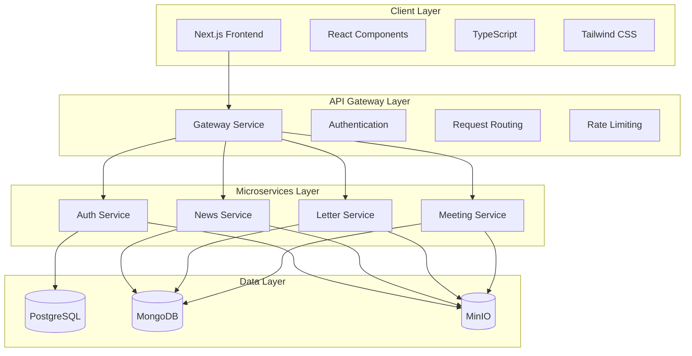
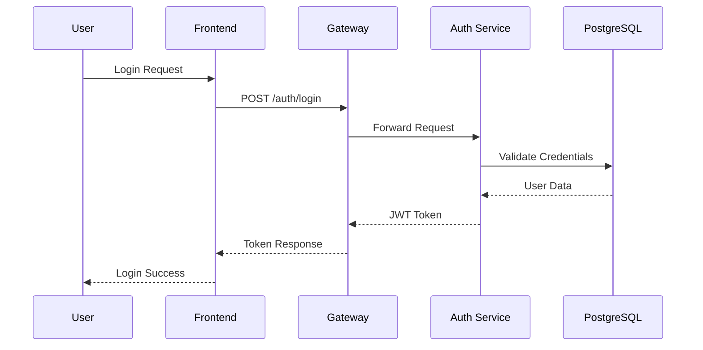
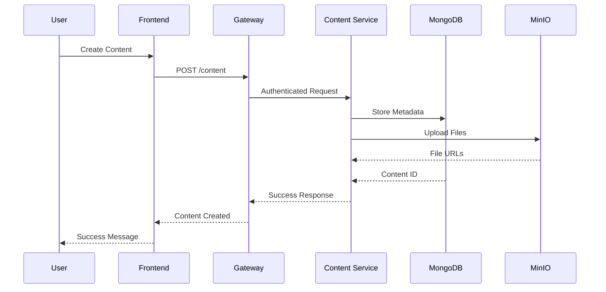
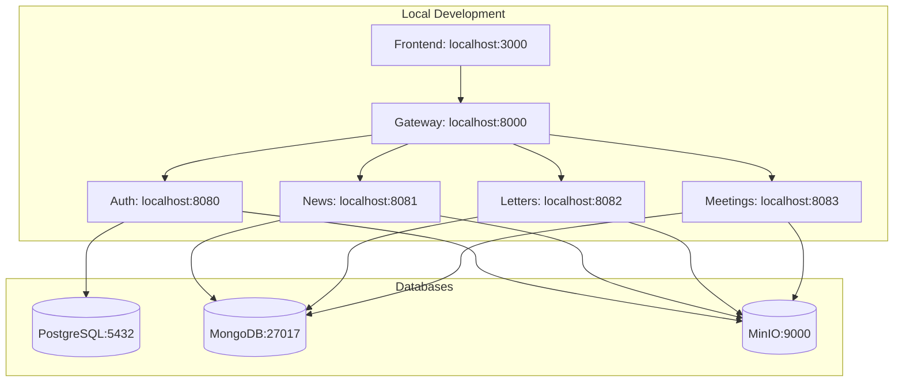
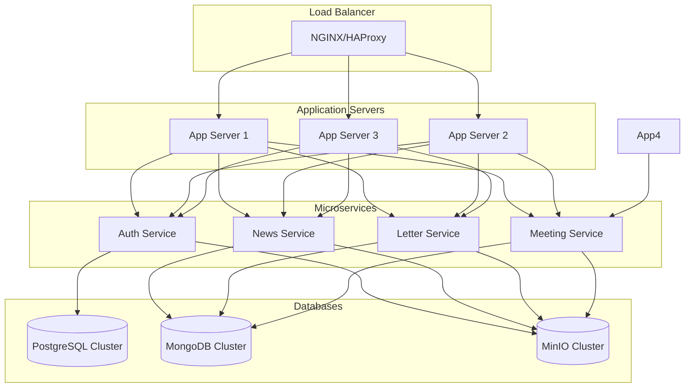

# SST Manager - Architecture Documentation

## System Overview

SST Manager is a microservices-based web application designed for Sunday School digital management. The system follows a modern architecture with clear separation of concerns, scalability, and maintainability.

## High-Level Architecture



## Component Details

### Frontend (Next.js)
- **Framework**: Next.js 15 with App Router
- **Language**: TypeScript
- **Styling**: Tailwind CSS + shadcn/ui components
- **State Management**: React Context + Custom Hooks
- **Forms**: React Hook Form + Zod validation
- **Internationalization**: i18next
- **Notifications**: Sonner

### API Gateway
- **Technology**: Go + Gin Gonic
- **Responsibilities**:
  - Authentication middleware
  - Request routing to microservices
  - Rate limiting
  - CORS handling
  - Request logging

### Microservices

#### Auth Service
- **Database**: PostgreSQL
- **Responsibilities**:
  - User authentication (JWT)
  - User management
  - Role-based access control
  - Password hashing
  - Session management

#### News Service
- **Database**: MongoDB
- **Responsibilities**:
  - News article CRUD operations
  - News publishing workflow
  - Content management
  - File attachments (via MinIO)

#### Letter Service
- **Database**: MongoDB
- **Responsibilities**:
  - Letter creation and management
  - Approval workflows
  - Document versioning
  - PDF generation
  - File storage integration

#### Meeting Service
- **Database**: MongoDB
- **Responsibilities**:
  - Meeting scheduling
  - Minutes recording
  - Attendance tracking
  - Meeting history

### Data Storage

#### PostgreSQL
- **Purpose**: Relational data storage
- **Usage**: User accounts, roles, authentication data
- **Benefits**: ACID compliance, complex queries, data integrity

#### MongoDB
- **Purpose**: Document storage
- **Usage**: News articles, letters, meetings, flexible content
- **Benefits**: Schema flexibility, JSON-like documents, scalability

#### MinIO
- **Purpose**: Object storage
- **Usage**: File uploads, images, documents, attachments
- **Benefits**: S3-compatible API, scalable, cost-effective

## Data Flow

### User Authentication Flow


### Content Creation Flow


## Security Architecture

### Authentication & Authorization
- **JWT Tokens**: Stateless authentication
- **Role-Based Access**: Admin/User permissions
- **Middleware**: Request validation at gateway level
- **Password Security**: Bcrypt hashing

### Data Protection
- **Input Validation**: Server-side validation
- **SQL Injection Prevention**: Parameterized queries
- **XSS Protection**: Input sanitization
- **CORS**: Configured origins
- **Rate Limiting**: DDoS protection

### File Security
- **Type Validation**: File type checking
- **Size Limits**: Upload restrictions
- **Secure URLs**: Time-limited access
- **Storage Encryption**: MinIO encryption

## Deployment Architecture

### Development Environment


### Production Environment


## API Design

### RESTful Endpoints

#### Authentication
- `POST /auth/login` - User login
- `POST /auth/logout` - User logout
- `POST /auth/refresh` - Token refresh
- `GET /auth/me` - Current user info

#### Admin Endpoints
- `POST /admin/create-user` - Create new user
- `GET /admin/users` - List all users
- `PATCH /admin/update-user` - Update user
- `GET /admin/stats` - System statistics

#### Content Endpoints
- `GET /news` - List news articles
- `POST /news` - Create news article
- `PUT /news/{id}` - Update news article
- `DELETE /news/{id}` - Delete news article

- `GET /letters` - List letters
- `POST /letters` - Create letter
- `PUT /letters/{id}` - Update letter
- `DELETE /letters/{id}` - Delete letter

- `GET /meetings` - List meetings
- `POST /meetings` - Create meeting
- `PUT /meetings/{id}` - Update meeting
- `DELETE /meetings/{id}` - Delete meeting

### Response Format
```json
{
  "success": true,
  "data": {},
  "message": "Operation successful",
  "timestamp": "2024-01-01T00:00:00Z"
}
```

### Error Format
```json
{
  "success": false,
  "error": {
    "code": "VALIDATION_ERROR",
    "message": "Invalid input data",
    "details": {}
  },
  "timestamp": "2024-01-01T00:00:00Z"
}
```

## Performance Considerations

### Caching Strategy
- **Redis**: Session storage, API response caching
- **CDN**: Static asset delivery
- **Browser Caching**: Frontend assets

### Database Optimization
- **Indexing**: Proper indexes on frequently queried fields
- **Connection Pooling**: Efficient database connections
- **Query Optimization**: Avoid N+1 queries

### Scalability
- **Horizontal Scaling**: Microservices can be scaled independently
- **Load Balancing**: Distribute traffic across instances
- **Database Sharding**: Split data across multiple servers

## Monitoring & Observability

### Health Checks
- Service health endpoints (`/health`)
- Database connectivity checks
- External service availability

### Logging
- Structured logging with correlation IDs
- Log aggregation (ELK stack)
- Error tracking and alerting

### Metrics
- Application performance monitoring
- Database query performance
- API response times
- Error rates

## Development Workflow

### Code Organization
- **Clean Architecture**: Separation of concerns
- **Dependency Injection**: Testable code
- **SOLID Principles**: Maintainable codebase
- **DRY Principle**: Code reusability

### Testing Strategy
- **Unit Tests**: Individual functions/components
- **Integration Tests**: Service interactions
- **End-to-End Tests**: Full user workflows
- **Performance Tests**: Load testing

### CI/CD Pipeline
1. Code commit triggers pipeline
2. Run tests and linting
3. Build Docker images
4. Deploy to staging
5. Run integration tests
6. Deploy to production

---

This architecture document provides a comprehensive overview of the SST Manager system. For detailed implementation specifics, refer to the individual service documentation and code comments.